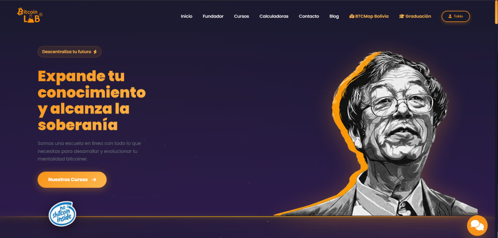
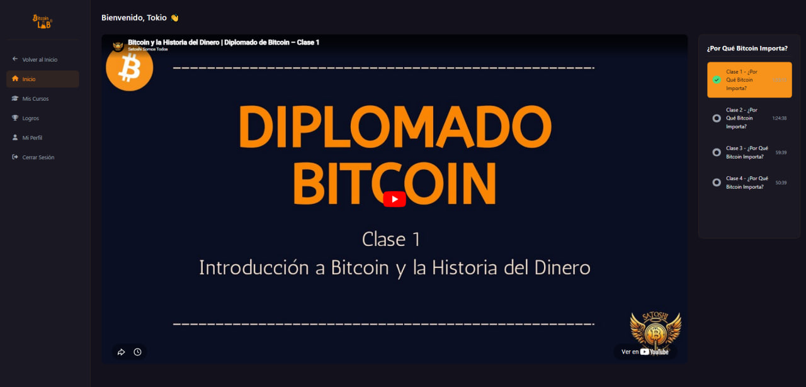
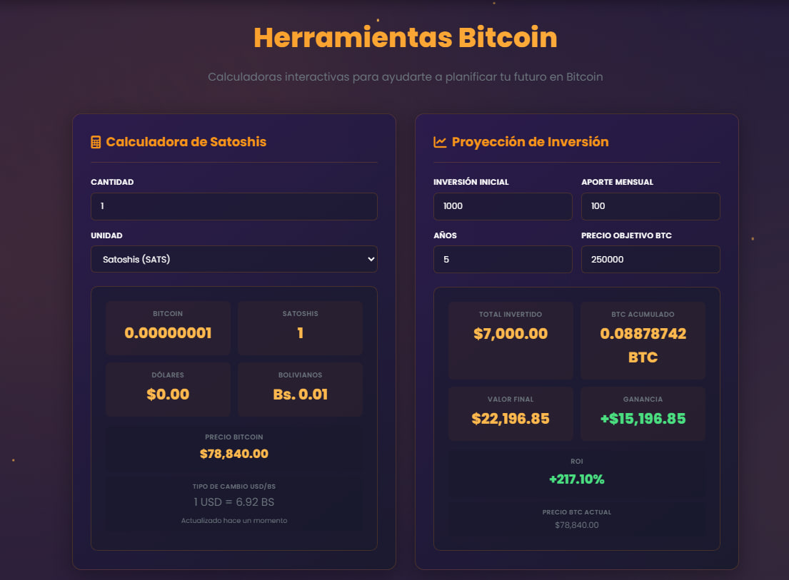
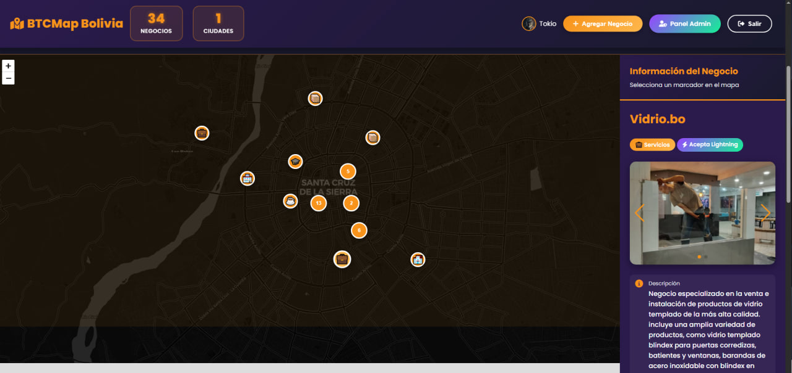
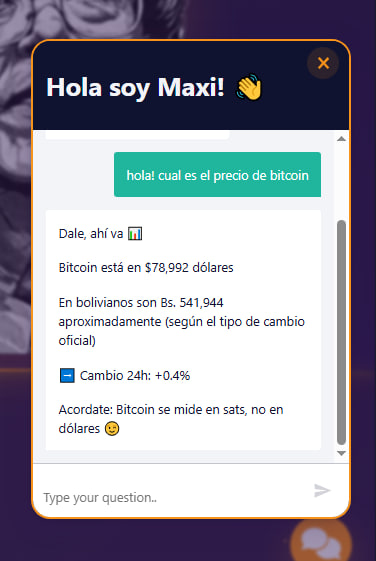
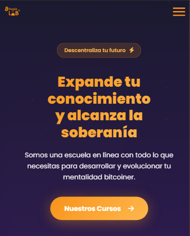

# BitcoinLab Bolivia

### Bitcoin education and community platform. Seven integrated tools, one mission.

Education · Calculator · Business Map · AI Agent · Blog · Certification · Admin

---

## What is this?

**BitcoinLab Bolivia** is the digital home of the Bitcoin Lab community in Santa Cruz de la Sierra, Bolivia. It's not a single product. It's an integrated set of tools serving the same audience: people in Bolivia learning, adopting, and using Bitcoin.

The platform combines Bitcoin courses with progress tracking, a real-time BTC/sats/USD/BOB calculator using local P2P market data, an interactive map of every business in Bolivia that accepts Bitcoin, an AI agent that answers Bitcoin questions in Spanish with live price data, a community blog, a certification program with diploma generation, and an admin panel for content moderation.

This repository is a **showcase**, a public portfolio of the platform's design and engineering. The source code is private and managed in coordination with the client.

> 🌐 **Live product:** [btclabbolivia.com](https://btclabbolivia.com/) · 📍 Santa Cruz de la Sierra, Bolivia · ⚡ Lightning-aware

---

## The Pillars

### 📚 Bitcoin Education

Structured courses for newcomers and intermediate Bitcoiners. Lessons load dynamically from Firestore, and progress is tracked per user across sessions.

- **Lesson tracking:** progress saved per user in Firestore, persistent across devices
- **Multi-course architecture:** courses are documents, lessons are subcollections, fully data-driven
- **Auth integration:** Firebase Email/Password and Google OAuth, with Spanish-localized flows
- **Curriculum:** Bitcoin fundamentals, sovereignty, P2P markets, and Lightning Network basics

---

### 🧮 Real-time Bitcoin Calculator

A four-way conversion tool (BTC ↔ sats ↔ USD ↔ BOB) with live prices pulled from Bolivia's actual P2P market, not a generic exchange feed.

- **BTC/USD price:** CoinGecko API with fallback chain
- **USDT/BOB price:** scraped from Binance P2P (the real exchange rate Bolivians use, not the official rate)
- **CORS workaround:** thin PHP proxies in `/api/` since the frontend is hosted on shared PHP hosting
- **Precision:** 8-decimal accuracy for BTC, satoshi-level for sats, two decimals for fiat

---

### 🗺️ BTCMap Bolivia

An interactive map of every business in Bolivia that accepts Bitcoin. Built with Leaflet, backed by Firestore, with a moderation pipeline so the community itself can submit places.

- **Custom markers** with category icons and Lightning Network badges
- **Marker clustering** for dense areas (`leaflet.markercluster`)
- **Sidebar gallery** with up to 3 photos per business, contact buttons (WhatsApp, directions), and category filters
- **Submission flow:** any user can submit a business with photos, which lands in `/pending-businesses`
- **Moderation pipeline:** admins approve or reject submissions from a dedicated admin panel, approved entries flow to `/businesses` and appear on the public map
- **Photo storage:** Firebase Storage with 5MB per file, lazy-loaded in the gallery

---

### 🤖 AI Agent (Maxi)

A Spanish-speaking Bitcoin chatbot embedded in the platform. Maxi answers questions about Bitcoin, returns live BTC/USD/BOB prices, explains concepts at the user's level, and gently corrects common misconceptions (like measuring Bitcoin in dollars instead of sats).

- **Live data integration:** real-time BTC price in both USD and Bolivianos, with 24h change
- **Localized to Bolivia:** uses the same P2P-derived BOB rate the calculator uses, not the official rate
- **Educational tone:** answers reinforce Bitcoin best practices (think in sats, not dollars)
- **Spanish-first:** designed for the Bolivian audience, no translation gymnastics
- **Embedded UX:** floating chat widget available across the platform

---

### 📰 Bitcoin Blog

A blog system where admins curate articles by simply pasting a URL. The platform extracts OpenGraph metadata automatically, generating preview cards without manual entry.

- **OpenGraph extraction:** custom PHP proxy parses `og:title`, `og:description`, `og:image` from any URL
- **Auto-thumbnail generation:** previews work for any external article
- **Firestore-backed:** posts are stored as documents, ordered by date
- **Admin-only writes:** moderation enforced via Firestore Rules and an admin email whitelist

---

### 🎓 Certification (Diplomado)

A multi-week Bitcoin certification program with online registration, lesson completion tracking, and an automated graduation flow.

- **Registration:** sign-up form posts to Firestore plus an n8n webhook
- **Progress requirement:** course must reach 100% completion before graduation is enabled
- **Diploma generation:** custom-designed certificate with the student's name, date, and a unique credential ID
- **n8n automation:** graduation triggers a webhook that pipes data to Google Sheets for the community's records

---

### 🛡️ Admin Panel

A purpose-built admin surface for the two areas that need active moderation: the business map and the blog.

- **Business moderation queue:** admins review pending submissions, see all photos, approve or reject with reason
- **Blog management:** create, edit, and delete posts via a clean admin UI
- **Single source of truth for admins:** `admin-config.js` exports a single `ADMIN_EMAILS` array used across every admin-gated surface, no duplication
- **Auth-gated:** every admin action requires email verification against the whitelist plus Firestore Rules enforcement

---

## Tech Stack

### Frontend
- **HTML5 + CSS3 + Vanilla JavaScript (ES6+):** no framework, no build pipeline
- **Mobile-first responsive:** every page works from 320px upward
- **Leaflet 1.9.4 + MarkerCluster 1.5.3:** the map stack
- **Swiper 11:** photo carousels in business sidebars
- **Font Awesome 6.5.1 + Google Fonts (Poppins):** icons and typography

### Backend
- **Firebase Authentication:** Email/Password and Google OAuth, Spanish-localized
- **Firestore:** courses, lessons, businesses, blog posts, user progress
- **Firebase Storage:** business photos with 5MB per-file limit
- **PHP 7.x+ proxies** in `/api/`: CORS workaround for Binance P2P, OpenGraph extraction, and price aggregation

### Automation
- **n8n workflows:** graduation pipeline triggers on course completion, pushes student data to Google Sheets

### Hosting
- **Hostinger shared hosting:** PHP-enabled, no Node.js, manual deploy via FTP

---

## Engineering Highlights

The interesting part of this project isn't a single hard technical problem. It's an architecture that fits its constraints precisely.

### 🎯 Pragmatic stack selection

The platform runs on Hostinger shared hosting, the most affordable option for a community-funded project. That single constraint defined the entire architecture: no Node.js (so no Next.js, no SSR, no build pipeline), PHP available (so PHP for CORS proxies), static files served directly (so vanilla HTML/JS with CDN dependencies). The result: the entire site deploys with one FTP upload, runs at $5/month, and has zero build-step failures because there is no build step.

A modern framework would have made the codebase look fancier on a resume. It would have also tripled hosting costs, required CI/CD setup, and added a maintenance burden the community cannot absorb. The right tool for this job was the boring tool.

### 📱 Mobile-first by necessity, not by trend

In Bolivia, most internet access happens on mobile devices. The platform was designed mobile-first from the start: every layout collapses gracefully from desktop through tablet to 320px, the calculator inputs are sized for thumbs, the map controls are touch-friendly, and the AI agent works as a native-feeling chat widget on small screens.

### 🌐 Multi-API price aggregation

The Bitcoin calculator pulls from three different upstream sources to produce a number Bolivians actually trust:
- **CoinGecko** for BTC/USD reference price
- **Binance P2P** for USDT/BOB (the real Bolivian exchange rate, not the official rate which differs by 50%+)
- **Custom fallback chain** in case any single API rate-limits

All external calls go through PHP proxies in `/api/` to handle CORS and to keep API key references off the frontend (where applicable).

### 🗺️ Map architecture

The BTCMap implementation glues Leaflet, Firestore, Firebase Storage, and an admin moderation queue. The data flow:

1. User submits business with photos via the public form
2. Photos upload to Firebase Storage, metadata writes to `/pending-businesses`
3. Admin reviews submission in `btcmap-admin.html`, approves or rejects with reason
4. On approval, document moves to `/businesses` and appears on the public map within seconds
5. Markers cluster automatically based on viewport zoom

No serverless functions, no message queues. Just Firestore document state transitions and admin discipline.

### 🤖 AI Agent integration (Maxi)

The chatbot is wired into a real-time data layer rather than just a static knowledge base. When a user asks about price, Maxi calls the same calculator pipeline (CoinGecko + Binance P2P), formats the response in Spanish with the local BOB conversion, and adds an educational nudge ("Bitcoin se mide en sats, no en dólares"). The agent answers in the user's language with the user's currency, using the user's real exchange rate.

### 🔒 Single source of truth for admin access

Admin email whitelist lives in one file: `admin-config.js`. Every admin-gated surface (blog admin, map admin, dashboard) imports from it. No duplication, no drift. When a new admin joins the community, one file changes, one file uploads, and access propagates everywhere.

### 📦 Zero build step

Every dependency loads from a CDN with SRI hashes where available. The repository contains exactly the files that get served to the browser. There is no `dist/`, no `node_modules/`, no `package.json`, no compilation step. The cognitive overhead of "what does the build do" simply does not exist.

### 🔄 OpenGraph extraction proxy

Pasting a URL into the blog admin auto-fills the post's title, description, and thumbnail. The trick is a small PHP proxy that fetches the URL server-side, parses meta tags with regex, and returns clean JSON. This means an admin can curate the blog by pasting URLs, with no manual data entry.

### 🤖 n8n automation

When a student completes a certification course, a webhook fires to n8n. The workflow validates completion, extracts student details, writes a row to a Google Sheet maintained by the community, and notifies the admin team. The platform doesn't manage state for the graduation process beyond the trigger; n8n owns the orchestration.

---

## About the build

Designed and developed by [@tokiopy](https://github.com/tokiopy) for **Bitcoin Lab Bolivia** (Santa Cruz de la Sierra), a community-driven Bitcoin education initiative led by Bruno.

The platform's vision and editorial direction belong to the community. Every technical decision, architecture choice, and line of code is the work of one engineer working as a freelance contractor.

**Project span:** 2024 → ongoing
**Status:** Live in production at [btclabbolivia.com](https://btclabbolivia.com/)

---

## Other projects

If you like this work, check out other things I've built:

- **[Satoshi's Playroom](https://github.com/tokiopy/satoshis-playroom-showcase)**: Bitcoin gaming platform with real-money multiplayer (Domino, Poker, Chess) on Lightning Network
- **Federación** *(coming soon)*
- **Satoshi Somos Todos** *(coming soon)*

---

## Connect

- 🌐 **Live site:** [btclabbolivia.com](https://btclabbolivia.com/)
- 💬 **GitHub:** [@tokiopy](https://github.com/tokiopy)
- 📧 **Email:** info@tokiohub.com

---

## License

This showcase repository (text and screenshots) is released under the MIT License. The underlying source code is **proprietary** and managed in coordination with the client.

Brand and content of BitcoinLab Bolivia belong to the Bitcoin Lab community.

---

**From Tokio With ⚡**

